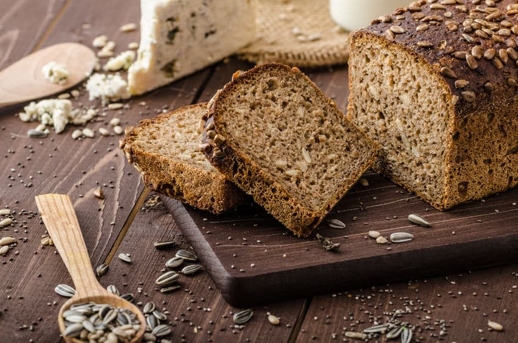
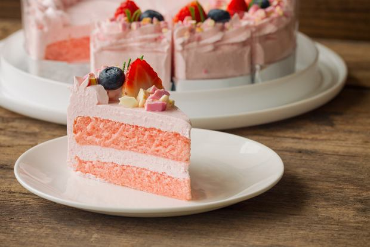
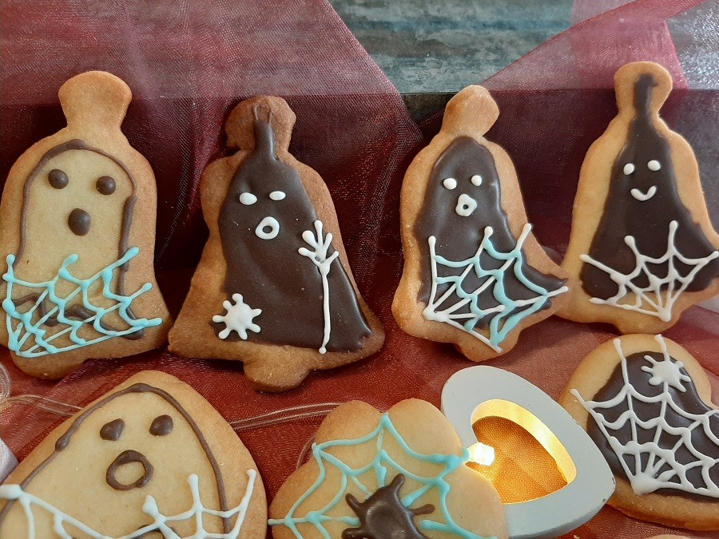

# Menu

## Chleby

|Lp.|Chleb:           |Skład:                                                                           |Cena: |
|---|-----------------|---------------------------------------------------------------------------------|------|
|1. |Pszenny          |(mąka pszenna, woda, zakwas piekarski żytni, drożdże, sól)                       |12 zł.|
|2. |Słonecznikowy    |(mąka pszenna, woda, ziarna słonecznika, cukier, olej rzepakowy, drożdże)        |15 zł.|
|3. |Razowy           |(mąka pszenna razowa, woda, siemię lniane, olej rzepakowy, sól)                  |15 zł.|
|4. |Żytni            |(mąka żytnia, woda, miód, oliwa z oliwek, drożdże, sól gruboziarnista)           |18 zł.|

## Ciasta

Przy zakupie całego ciasta (8 kawałków), 1 kawałek jest liczony jako gratis.

|Lp.|Ciasto:          |Skład:                                                                                                                       |Cena za kawałek:|Cena za całość:|
|---|-----------------|-----------------------------------------------------------------------------------------------------------------------------|----------------|---------------|
|1. |Marchewkowe      |(mąka pszenna, cukier, olej roślinny, jajka, marchewka, orzechy włoskie, wiórki kokosowe, proszek do pieczenia, cynamon, sól)|13 zł.          |91 zł.         |
|2. |Szpinakowe       |(mąka pszenna, cukier, olej roślinny, jajka, szpinak, granat, serek mascarpone, śmietanka 36%, wanilia)                      |14 zł.          |98 zł.         |
|3. |Miodownik        |(mąka pszenna, cukier, cukier wanilinowy, masło, jajka, miód, mleko, masa budyniowa)                                         |16 zł.          |112 zł.        |

|Lp.|Ciasto sezonowe:  |Skład:                                                                                                                       |Cena za kawałek:|Cena za całość:|
|---|------------------|-----------------------------------------------------------------------------------------------------------------------------|----------------|---------------|
|1. |Truskawkowe       |(mąka pszenna, cukier, cukier wanilinowy, olej roślinny, jajka, truskawki, serek homogenizowany, agar.)                      |19 zł.          |133 zł.        |
|2. |Ciasto z borówkami|(mąka pszenna, cukier, cukier wanilinowy, masło, jajka, borówki, skórka cytryny, twaróg, śmietanka 36%, masa budyniowa       |19 zł.          |133 zł.        |

## Wypieki okazjonalne na zamówienie

Składy wypieków okazjonanych do uzgodnienia przy składaniu zamówienia.

|Lp.|Ciasto:               |Średnica:  |30 cm |40 cm |50 cm | 
|---|----------------------|-----------|------|------|------|
|1. |Biszkopt z kremem     |           |80 zł |150 zł|220 zł|
|2. |Tort zdobiony         |           |130 zł|240 zł|360 zł|
|3. |Tort piętrowy zdobiony|           |170 zł|320 zł| 490zł|

|Lp.|Ciastka:                       |Ilość:     |10    |50    |100   | 
|---|-------------------------------|-----------|----- |------|------|
|1. |Zdobione lukrem                |           |30 zł |140 zł|250zł |
|2. |Zdobione polewami              |           |40 zł |185 zł|325 zł|
|3. |Unikatowe kształty i zdobienia |           |50 zł |230 zł|400 zł|
